<h1 align="center">RACING LINE</h1>

<h2 align="center"> Go Karting website based in Swansea, South Wales.</h2>

<h2 align="center">Milestone Project 1 - Lee Smith</h2>

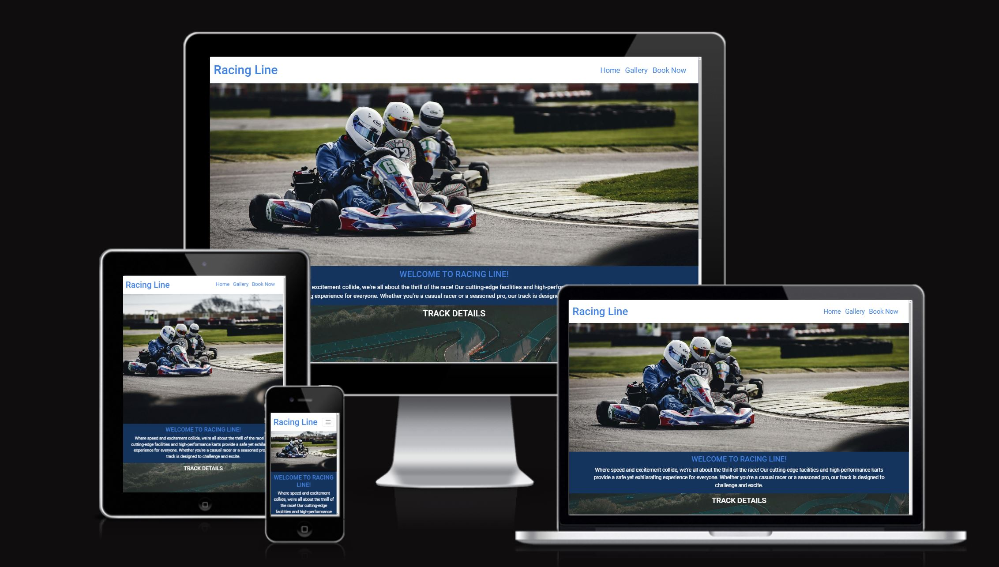
---

# UXD

# Purpose of the Project

I have decided to create a website base on a go karting company creating thier first website.

I am aiming to create a website that feels up-to-date with mobile first design at mind which will include a Home / Gallery / Book Now page. This websiite will be easy to navigate and to be able to easily book a go-karting slot for the customers.

This website is aimed to bring an online presence that will increase customers, showcase the facility.

# User Stories 

* As a customer, I would like to be able to visit and navigate through the website.
* As a customer, I would like to be able to easily book online.
* As a customer, I would like to be able to see your prices.
* As a customer, I would like to know details about the track.
* As a customer, I would like to be able to locate where the track is.
* As a customer, I would like to be able to contact you by email / phone / social media.

## Steps to be taken

1. Research websites.
2. Sketch up designs.
3. Create wireframe designs.
4. Find mixed content that works together (Colour Scheme, Font Family, Images).
5. Find how the mixed content will work together (Format, Purpose, Size).
6. Design Website.
7. Create Website.
8. Test Website.
9. Deploy Website.
  
# Features

* __Navigation Bar__

    The Navigation Bar would located at the top on the page and will have 3 links to the Home page, Gallery and Booking page. Also the page logo will be a link to the home page from any page visited.
        

 * __Home Page Image__

      The home page image which was selected shows the enjoyment and competitiveness of karting.

* __First Paragraph__

  The first paragraph follows straight after the home image this paragraph is short and snapping but will get the user excited.

* __Track Image__

  The Track image will then follow, this is for the user to get a visual on the track and build on the excitment.

* __Track Details__

  Added on top on the track image there is be a title of track details and at the bottom of the image will be 3 boxes which will include small snappy sentences explaining track distance, amount of turns and speed of the karts.

* __Book Button link__

  The Track image and track details will then be followed by a Book Now button which will send the user straight to the booking page.

* __Footer__
      
  The footer of the page will include links to social media websites

* __Gallery Page__

  The gallery page will have 3 images which will give more information about the track while showing off the different turns and excitement of the track and will have the book now button showing after the 3rd image.

* __Book Now Page__

  The Book Now page will start off with another paragraph will will increased excited in booking a season.

* __Booking Form__

  The booking form will have a more focus images of the track but will keep excitment up while completed the booking information.
      
  This will be followed by a Form on top of the image which we will require First name, Last Name, Email, Number of Drivers, date, time and submited button.

* __Where to Find us__

  After the booking form there will be a where to find us section and this will show where we are on the map and also have the address, opening times, phone number and email address to be easily contacted will any questions.

## Future Features

* Login Option.
* Leaderboard Page.
* Memebership Page.
* Competition Page.
* Food and Drinks Page.
* Add Video Content (Live stream of the track).
* Downloadable Health and Safety Form.
* Options To Buy Equitment.
* Testimonials section
* Dark Mode

# Typography and Color Scheme

The site will use the font of ROBOTO throughout the website.

The Color Scheme will include 3 main HEX colours -
  
* #008AE7 - Light Blue
* #01375E - Dark Blue
* #FDFDFD - White

With 2 additional HEX colours -

* #464545 - Dark Gray
* #BB0202 - Red

These colours work well together and will make the website clear and visually appealing.

# Wireframes

All wireframes were made using [Figma](https://www.figma.com/)

----

## Mobile Wireframe

---

## Tablet Wireframe

---

## Desktop Wireframe

---
# Technology
* __HTML__
* __CSS__
* __Hover.css__
* __Bootstrap__
* __Flexbox__
* __Font Awesome for icons__
* __Google Fonts__
* __Git__
* __GitHub__
* __Figma__

# Testing

## Code Validation

### __W3 Validator__

#### __Home Page__

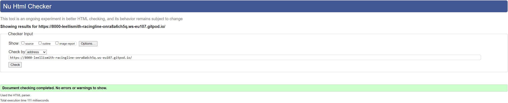

#### __Gallery Page__

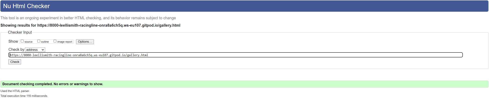

#### __Booking Page__

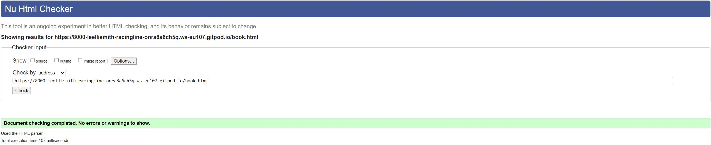

#### __CSS Validation__

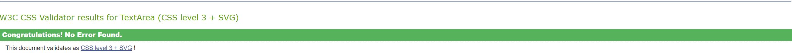

### __Lighthouse Testing__

### __Home Page Testing__

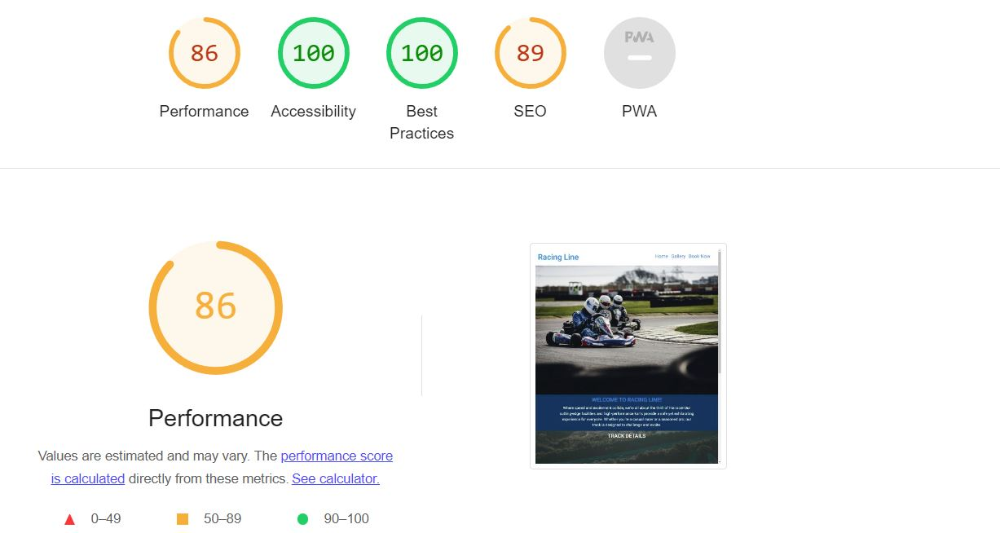

    As you can see from the testing images the home page performance was at 86 after 
    looking in to the issue it seems that this was because of the image file sizes.
    After compressing the image the performace and after added meta description both scores 
    have improved as you can see in the second lighthouse test below.

 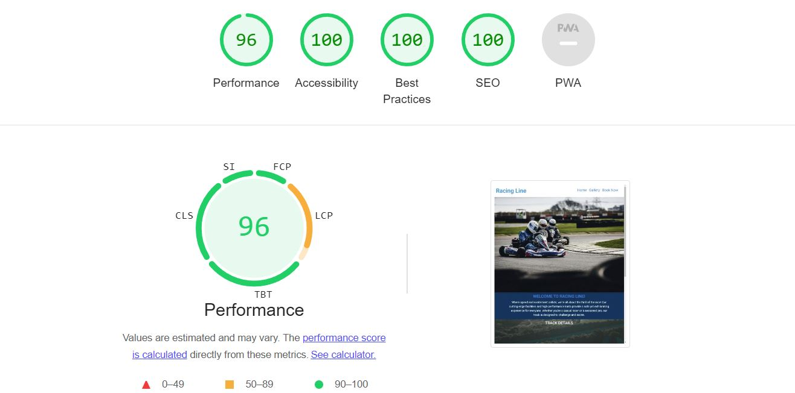

### __Gallery Page Testing__

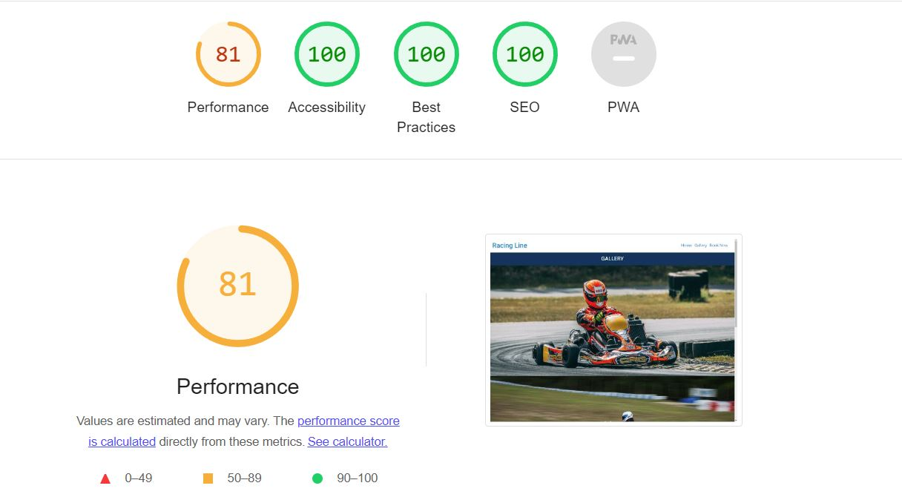

    As you can from the the testing on the gallery page the performance is a little 
    low as the image size where too large. After compressing images this has improved the performance.

### __Booking Page Testing__

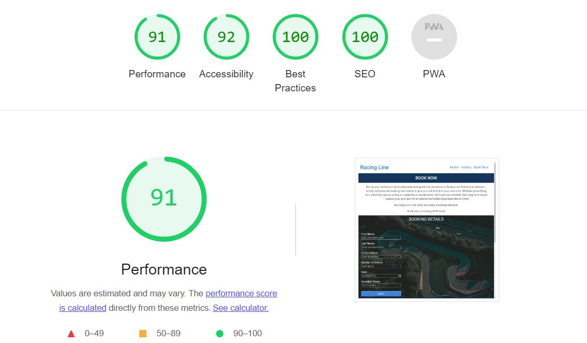

    The booking page testing was very good from the start but could be improved once again by
    compressing the image file.

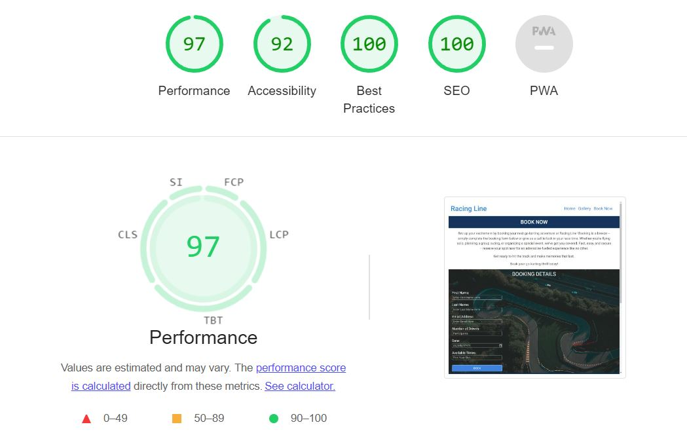

# Test Cases

# Fixed Bugs

  * Fixed isses with image scaling in gallery by added media query at different sizes.

  * I Had issues with the three boxes in track details. after researching on (https://css-tricks.com/snippets/css/a-guide-to-flexbox/) and trial and error on developer tools, I managed to get the boxes to be reactive with enlarging website.

 * Had a bug with the Form where on the smaller screens it would start to overlap.

 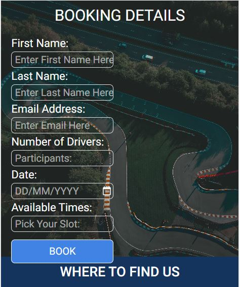

* I fixed this issue by adding padding to the bottom of the form.
    

### Supported Screens and Browsers

## Deployment

## Github Pages

The Site was deployed via GitHub Pages.

1. Go to GitHub.
2. Find RacingLine repository or [Click Here](https://github.com/leellismith/RacingLine).
3. Go to settings [Click Here](https://github.com/leellismith/RacingLine/settings).
4. On the left hand side of the General tab click on Pages [Cllck Here](https://github.com/leellismith/RacingLine/settings/pages).
5. In Build and deployment, select Deploy from a branch.
6. Then In branch select the Main tab and the /(Root) tab.
7. Then click save and wait for the deployment to go live.

---

# Credits

### __Images used on home page are taken from__ (https://unsplash.com/)
## Home Image
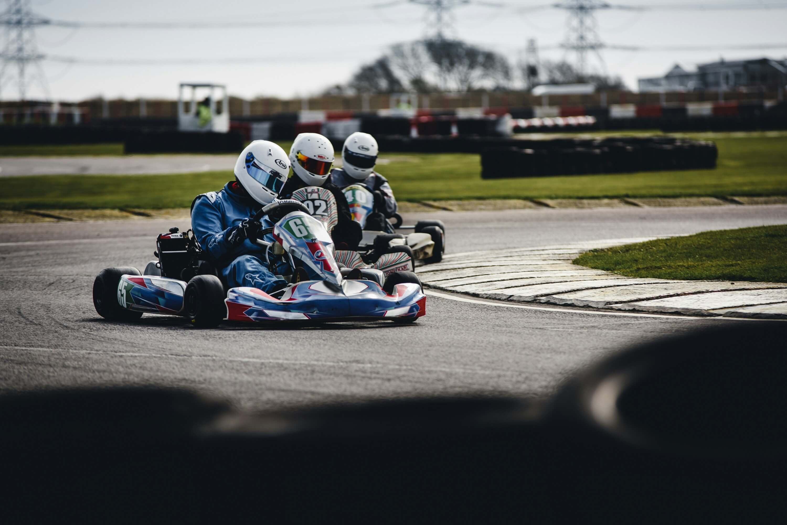
## Track Image
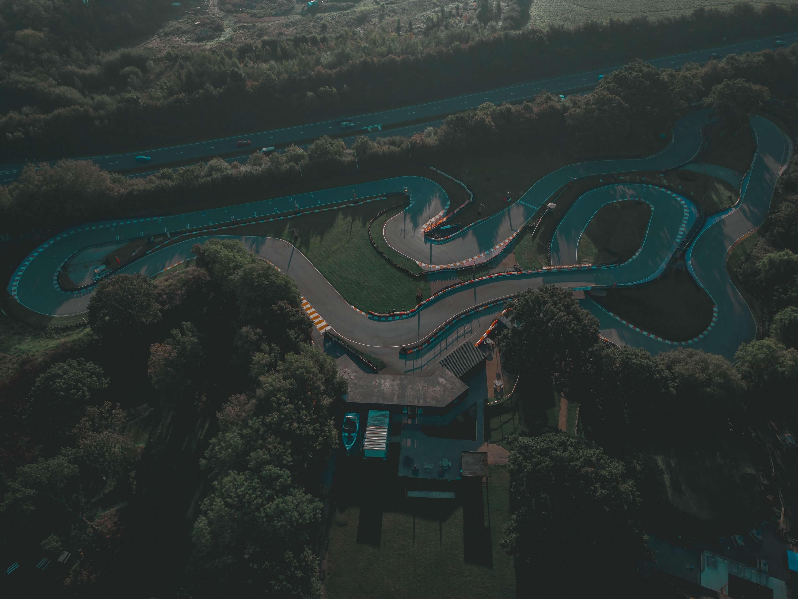
## 1st Gallery Image

## 2nd Gallery Image

## Booking Track Image
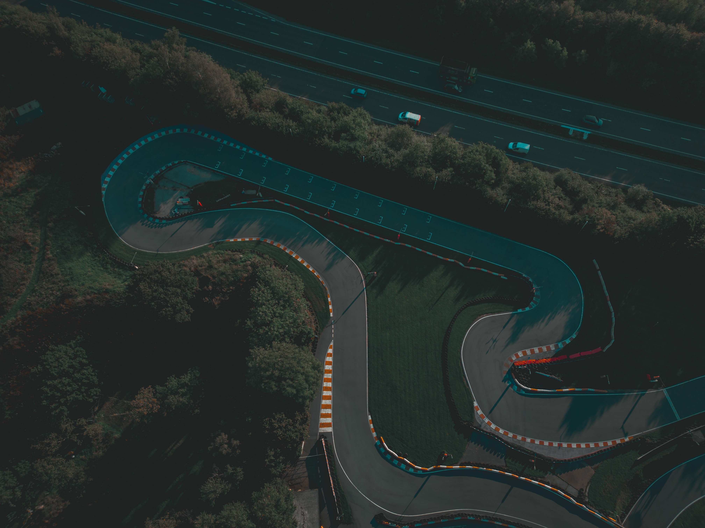
### __Image used from__ (https://www.pexels.com)
## Third Gallery Image

### __Navbar taken from [Bootstrap](https://getbootstrap.com/docs/5.3/components/navbar/)__

### __Botton taken from [Bootstrap](https://getbootstrap.com/docs/5.3/components/buttons/)__

### __Animation taken from [Code institute - Love Running](https://learn.codeinstitute.net/courses/course-v1:CodeInstitute+CSE101+2020_Q2/courseware/be0e510a3aca4bccb6e0bba4cf7cf06b/83c6c94d55f44c79a3646810d80ce7a3/)__

### __Icons taken from [Fontawesome](https://fontawesome.com/icons)__

# Acknowledgements

* __I wanted to remove the orange border when the input field was selected and found out how to do it on [W3docs](https://www.w3docs.com/snippets/css/how-to-remove-and-style-the-border-outline-around-text-input-boxes-in-google-chrome.html)__

* __I wanted to add a label input where you could select an amount for people booking (<https://getbootstrap.com/docs/5.3/forms/overview/>)__
