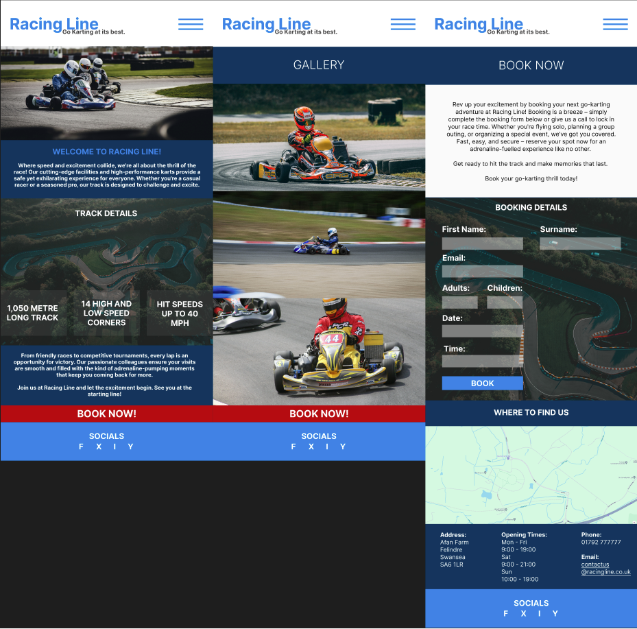
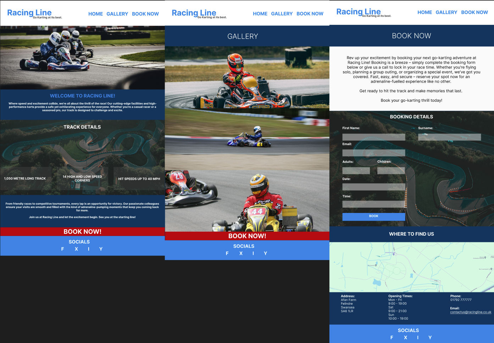
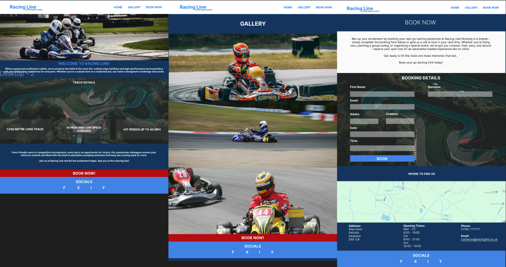
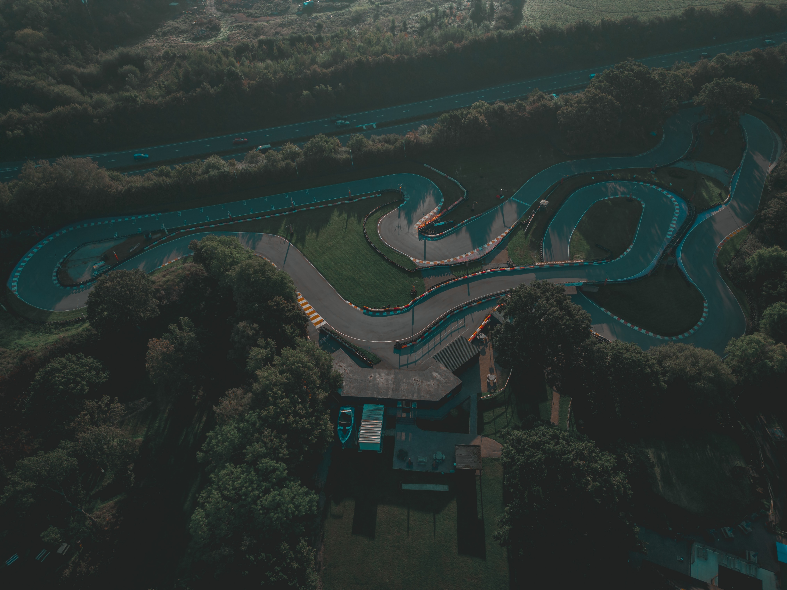
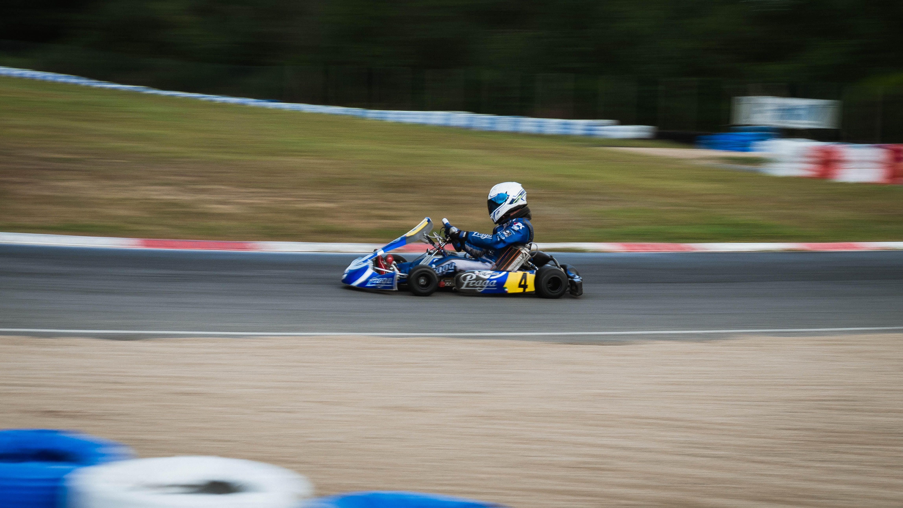
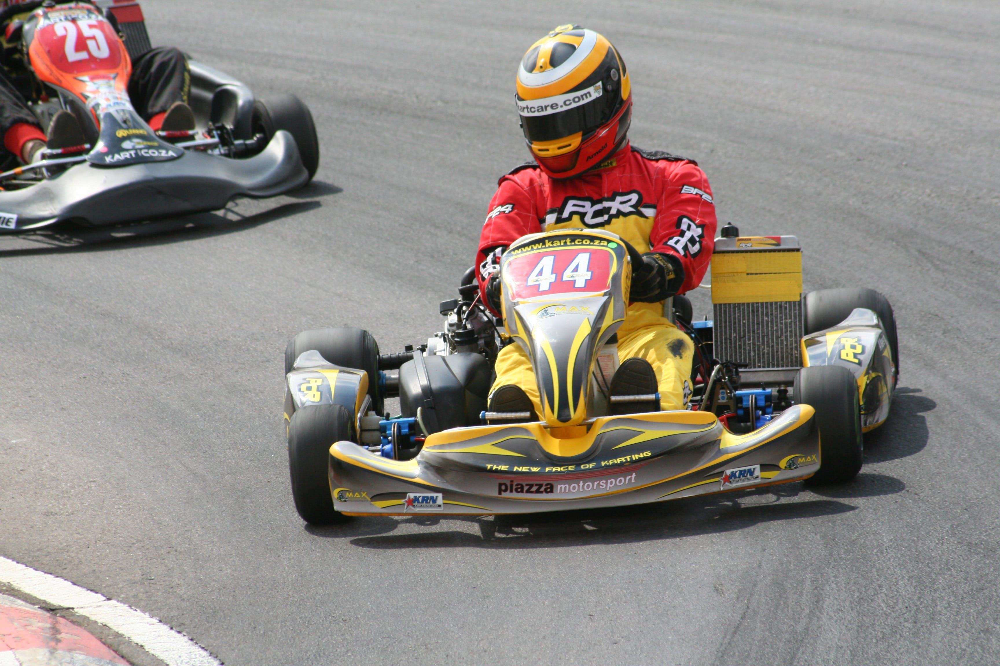

# RACING LINE

# UXD

## Purpose of the Project

I have decided to create a website base on a go karting company creating thier first website.

I am aiming to create a website that feels up-to-date with mobile first design at mind which will include a Home / Gallery / Book Now page. This websiite will be easy to navigate and to be able to easily book a go-karting slot for the customers.

This website is aimed to bring an online presence that will increase customers, showcase the facility.

## User Stories -

* As a customer, I would like to be able to visit and navigate through the website.
* As a customer, I would like to be able to easily book online.
* As a customer, I would like to be able to see your prices.
* As a customer, I would like to know details about the track.
* As a customer, I would like to be able to locate where the track is.
* As a customer, I would like to be able to contact you by email / phone / social media.

### Steps to be taken -

1. Research websites.
2. Sketch up designs.
3. Create wireframe designs.
4. Find mixed content that works together (Colour Scheme, Font Family, Images).
5. Find how the mixed content will work together (Format, Purpose, Size).
6. Design Website.
7. Create Website.
8. Test Website.
9. Deploy Website.
  
## Features

The website will include features such as Home page with text and details about the track followed by a Gallery with a selection of images then a Book Now page with prices and a easy to book now form with a map and a where to find us, opening times and contact us details and lastly a footer with links to social media websites which will enclose icons and you will be able to go through these pages with a navigation bar at the top of the page.

## Future Features

* Login Option.
* Leaderboard Page.
* Memebership Page.
* Compition Page.
* Food and Drinks Page.
* Add Video Content (Live stream of the track).
* Downloadable Health and Safety Form.
* Options To Buy Equitment.
* Testimonials section
* Dark Mode

## Typography and Color Scheme

The site will use the font of ROBOTO throughout the website as it has many different styles.

The Color Scheme will include 3 main HEX colours -
  
* #008AE7 - Light Blue
* #01375E - Dark Blue
* #FDFDFD - White

With 2 additional HEX colours -

* #464545 - Dark Gray
* #BB0202 - Red

These colours work well together and will make the website clear and visually appealing.

## Wireframes

### Mobile Wireframe

### Tablet Wireframe

### Desktop Wireframe

## Technology

Used bootstrap (nav and button)
font awesome for icon
google fonts

## Testing

### Code Validation

### Test Cases

### Fixed Bugs

### Supported Screens and Browsers

## Deployment

### Via Gitpod

### Via Github Pages

## Credits

Images used on home page are taken from (https://unsplash.com/)

Image used from (https://www.pexels.com)

Navbar taken from (https://getbootstrap.com/docs/5.3/components/navbar/)

Botton taken from (https://getbootstrap.com/docs/5.3/components/buttons/)